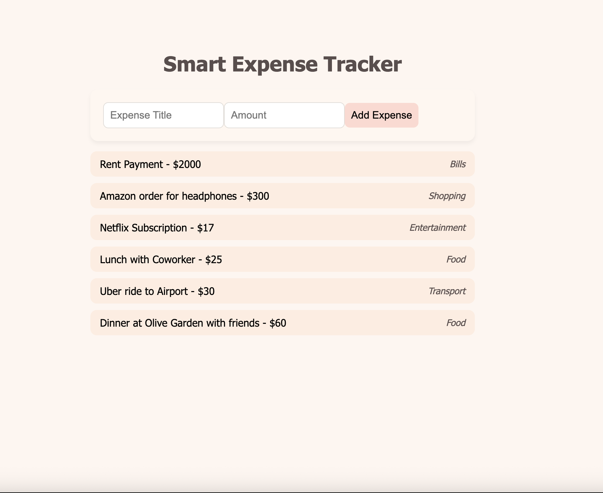

# AI Smart Expense Tracker

A simple full-stack **Expense Tracker** built using **React, Node.js, Express, and PostgreSQL** with **AI-based automatic expense categorization** using a free Hugging Face API.

---

## Features

* Add expenses (title + amount)
* AI automatically predicts category
* Stores data in PostgreSQL
* Displays all expenses in a clean UI
* Uses free AI API (zero-shot classification)

---

## Tech Stack

**Frontend**

* React
* CSS
* Fetch API

**Backend**

* Node.js
* Express

**Database**

* PostgreSQL

**AI**

* Hugging Face Zero-Shot Classification API

---

## Project Structure

```
expense-tracker/
│
├── client/        # React frontend
├── server/        # Node/Express backend
├── screenshots/   
└── README.md
```

---
### Home Page


### Add Expense


### AI Categorization


---

## Setup Instructions

### 1. Clone the repository

```
git clone https://github.com/YOUR_USERNAME/expense-tracker.git
cd expense-tracker
```

---

## Backend Setup

Go to server folder:

```
cd server
npm install
```

Create a `.env` file:

```
PORT=5001
HF_API_KEY=your_huggingface_api_key
```

Run backend:

```
node index.js
```

Server runs at:

```
http://localhost:5001
```

---

## PostgreSQL Setup

Open terminal:

```
psql postgres
```

Create database:

```
CREATE DATABASE expensesdb;
```

Connect:

```
\c expensesdb
```

Create table:

```
CREATE TABLE expenses (
  id SERIAL PRIMARY KEY,
  title TEXT,
  amount NUMERIC,
  category TEXT,
  created_at TIMESTAMP DEFAULT CURRENT_TIMESTAMP
);
```

Exit:

```
\q
```

---

## Frontend Setup

Go to client folder:

```
cd client
npm install
npm start
```

Frontend runs at:

```
http://localhost:3000
```

---

## API Endpoints

**Get all expenses**

```
GET /expenses
```

**Add expense**

```
POST /expenses
```

**AI categorize**

```
POST /ai/categorize
```

---

## Example Input

```
Dinner at restaurant
```

Example Output:

```
Food
```

---


